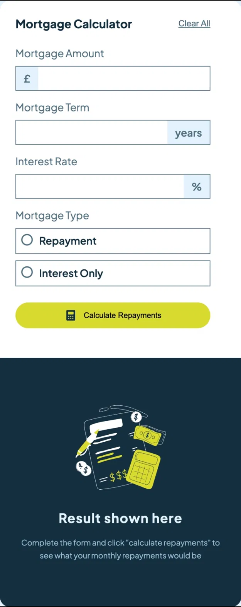

# Frontend Mentor - Mortgage repayment calculator solution

This is a solution to the [Mortgage repayment calculator challenge on Frontend Mentor](https://www.frontendmentor.io/challenges/mortgage-repayment-calculator-Galx1LXK73).

## Table of contents

- [Overview](#overview)
    - [The challenge](#the-challenge)
    - [Screenshot](#screenshot)
    - [Links](#links)
- [My process](#my-process)
    - [Built with](#built-with)
    - [What I learned](#what-i-learned)
    - [Continued development](#continued-development)
    - [AI Collaboration](#ai-collaboration)
- [Author](#author)

## Overview

### The challenge

Users should be able to:

- Input mortgage details including amount, term and interest rate
- Select between repayment and interest only mortgage types
- See form validation errors when fields are submitted empty
- View monthly repayment and total repayment amounts
- See the results update when the form is recalculated
- Reset the form using when the form is recalculated
- Reset the form using the Clear All button
- View the optimal layout depending on their device screen size

### Screenshot

| Desktop | Mobile |
|---------|--------|
|  | 

### Links

- Solution URL: []
- Live Site URL: []

## My process

### Built with

- React
- Vite
- SCSS
- Flexbox
- CSS Grid
- Mobile-first workflow
- Plus Jakarta Sans (Google Fonts)

### What I learned

The biggest learning in this project was implementing the mortgage repayment formula:

M = P * (r(1+r)^n) / ((1+r)^n - 1)

Where P ids the principal, r is the monthly interest rate ad n is the total number of months. Translating a mathematical formula into Javascript and understanding why each part exists was a new challenge.

I also learned how to validate a form without using a form element in React - building a newErrors object, using Object.values() and .some(Boolean) to check if any errors exist before proceeding to the calculation.

Customising radio buttons using appearance: none and ::after pseudo-elements to create a fuoly branded radio button that matches the design was another new technique I picked up.

I also learned how to use toLocaleString() to format numbers with commas and decimal places in one step instead of chaining t0Fixed().

### Continued development

- I want to get more comfortable with complex CSS positioning
- T want to practice more form validation patterns
- I want to explore adding animations when results appear
- I want to improve my understanding of mathematical formulas in JavaScript

### AI Collaboration

- Used Claude (claude.ai) for guidance throughout the challenge 
- Used it to understand the mortgage formulas and gow to translate them into JavaScript
- Helpful for debugginh validation logic and understanding why certain approaches work better than others
- Focused on understanding concepts rather than copying code

## Author

- Frontend Mentor - []
- GitHub - []